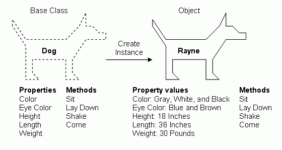

# 面向对象

之前的教程介绍的是我们如何面向过程编程，以下介绍面向对象。  
对只想快速入门的读者来说，此部分可以暂时跳过。但对于想借此入门程序设计，或者要自己设计较为复杂的程序功能，亦或者是相对别人的程序、调用的包有较深的了解，此部分还是学习较好。


## 什么是面向对象
面向对象这个词是相对于面型过程而言的。面向过程相当于我们前面说的顺序化的编程思想，从程序开始到程序结束，程序设计和我们解决方法的思路一致，有一个“流”来控制整个过程。而面向对象则是把对于一种对象有关的概念都独立出来，围绕这个对象来进行程序设计。


## 为何要面向对象
我们为何要将代码封装为函数？把相同或相似功能的代码块集合到一起，我们只需要写一次就能进行多次调用。  
我们为何要将相近的内容和概念封装为一个类？
- 逻辑更清晰；
- 更容易维护；
- 通过继承的手段，使程序更容易复用；
- 利用多态的手段，使程序更易扩展。


## 类与实例
在面向对象的程序设计中，类与实例（有些语言直接将实例称之为“对象”）的概念非常重要。
类与实例的关系与区别，一图以蔽之：  
  
（图片来自：[Build Your Own ASP.NET Web Site Sample Chapter](http://www.4guysfromrolla.com/webtech/chapters/BuildASPNETWebSite/ch02.2.shtml#fig-classisblueprintforobject)）  
类是生产实例的模板，实例是类生产出的具体的对象。


## 类
书写一个最简单的类。

    class Dog:
        pass
    
生成实例。

    dog = Dog()

输出对比。

    print(Dog)
    print(dog)


## 初始化与实例属性
我们可以在类中以定义`__init()__`方法来初始化我们的类，在初始化方法中，我们接受参数，并给我们的“狗”起名（为实例添加上实例属性）。

    class Dog:
        def __init__(self, name):
            self.name = name

    dog = Dog('Alpha')
    print(dog.name)

我们注意到在初始化`__init__()`方法中，第一个参数是self，这个self指实例本身，并且在所有实例方法中都要以第一个参数显式调用。
 
> 其实除了实例方法外还有类方法等不需要调用self，初学者可以暂时不掌握。


## 实例方法
除了初始化方法，我们也可以在类中定义一些函数来作为实例化以后的实例方法。以下，我们给我们的狗设置一些实例方法。

    class Dog:
        def __init__(self, name):
            self.name = name

        def set_properties(self, color, eye_color):
            self.color = color
            self.eye_color = eye_color

        def get_properties(self):
            print("{} dog has {} eyes.".format(self.color, self.eye_color))

        def sit(self):
            print(self.name + ' is sitting.')

    dog = Dog('Alpha')
    dog.set_properties('yellow', 'brown')
    dog.get_properties()
    dog.sit()


## 类属性与类方法
此部分不常用，初学者可跳过。  
除了实例化时会有实例的属性与方法外，我们的类本身其实也有其属性与方法。类属性直接在类中定义就行，前面不用加`self`等标识；类方法要加上`@classmethod`装饰符，类似实例方法传入`self`作为参数表示实例本身，类方法中是传入`cls`作为参数表示类本身。  
现在我们需要知道我们应用了“狗”类生成了多少狗的实例，并把这个数字存在类中，我们就可以这么做。 

    class Dog:
        population = 0

        def __init__(self, name):
            self.name = name
            Dog.population += 1

        def set_properties(self, color, eye_color):
            self.color = color
            self.eye_color = eye_color

        def get_properties(self):
            print("{} dog has {} eyes.".format(self.color, self.eye_color))

        def sit(self):
            print(self.name + ' is sitting.')

        @classmethod
        def how_many(cls):
            print("There are {} dogs.".format(cls.population))


    alpha = Dog('Alpha')
    beta = Dog('Beta')
    gamma = Dog('Gamma')
    Dog.how_many()


## 继承
继承是面向对象中一个重要概念，指的是一个类（子类）可以利用继承机制沿用其他类（父类）的属性以及方法。  
我们首先定义一个动物类

    class Animal:
        def __init__(self, name):
            self.name = name

        def set_properties(self, color, eye_color):
            self.color = color
            self.eye_color = eye_color

        def get_properties(self):
            print("{} animal has {} eyes.".format(self.color, self.eye_color))

        def sit(self):
            print(self.name + ' is sitting.')


然后再定义两个类继承了该类

    class Dog(Animal):
        def __init__(self, name):
            super().__init__(name)

        def sit(self):
            print(self.name + ' is a dog who is sitting.')


    class Cat(Animal):
        def __init__(self, name):
            super().__init__(name)

        def sit(self):
            print(self.name + ' is a cat who is sitting.')

我们看到猫狗两个类继承了动物类的所有属性与方法，但却又重新写了`sit()`方法，这一操作叫做‘重载’。子类继承父类的属性与方法时，若没有进行重载，则直接用父类的属性与方法，若进行了重载，则将使用‘重载’后的属性与方法。

    alpha = Dog('Alpha')
    beta = Cat('Beta')
    alpha.set_properties('yellow', 'brown')
    beta.set_properties('black', 'blue')
    alpha.get_properties()
    beta.get_properties()
    alpha.sit()
    beta.sit()

我们执行以上代码，会发现Dog类与Cat类直接沿用了Animal类的`set_properties()`方法与`get_properties()`方法，重载并用了自己的`sit()`方法。


> 在定义类的时候，如果你没有需求，当然可以不去继承任何的父类。但一般习惯上，我们都会继承python里的基础类`object`，即以上的`Animal`类可以这么写：
> ```
>   class Animal(object):
>       ...
> ```
> 继承`object`会给你所定义的类新增一些基本的内建方法。对于python3来说，不这么写其实效果也一样，因为在python3中默认你的类会继承`object`（就算你没有显式地去表明这一点）。

## 习题
1. 从前有个美丽的星球，住着一个种族叫Abel族，他们快乐地生活着。可是好景不长，星球的环境持续恶化，Abel族的生存遇到了危机。  
Abel族个体体内的DNA编码将决定他们是否能在外部环境中生存下去，该DNA编码共有一百位十进制数，每一节点上数字（0-9）表示这一节点提供的生存能力，这个个体所拥有的生存能力即为100位编码之和（可以知道生存能力最高为900）。为了应对环境变化，Abel族开始了繁殖进化的过程。繁殖的过程为无性繁殖，每一个体都会繁殖出和自己DNA基本一致的个体，说是“基本”是因为每次子代都会在DNA编码的一个随机位置处进行变异，编码会随机+1、-1（最高为9，最低为0，超过范围则不变）。  
外部环境等级从0开始递增，每次增加1，增加一次的过程恰好Abel族能繁殖两次，若是Abel族个体的生存能力小于环境等级，则该个体将在环境中淘汰。整个星球的资源只能支持1000个个体，若是种群超过这一数量，将选择生存能力最高的1000个个体生存，其他均淘汰。  
已知初始个体dna编码皆为0，初始个体总数为100。
    1. 定义一个Abel类，并且该类有：
        - dna属性
        - 生存能力属性
        - 初始化方法（通过外部传入的DNA编码进行初始化）
        - 繁殖方法（返回一个新的Abel个体，要在繁殖过程中体现变异过程）
        - 变异方法
    2. 用一个列表存储该种族的所有个体，并给出一个淘汰个体的函数（参数为该列表和环境等级，淘汰需要体现由于环境淘汰和由于种群数量限制淘汰）。
    3. 加入环境变化，并通过环境新增和淘汰个体。
    4. 输出每次环境变化种族生存数量，和最高生存能力的dna片段。看看Abel族最终会消亡于何种环境等级中。  


2. 没想到这个星球的地底住着另一个种族Cauchy族，他们也因为环境的变化不得不搬到地面上生活。但是星球的资源有限，资源只能支持1000个个体存活，无论这个这个个体是哪个种族。
Cauchy族的DNA编码同样有100位，他们的繁殖能力较弱，每次环境变化只能繁殖一次，但是他们的变异能力强，编码每次会+2、-2（最高为9，最低为0，超过则保持9或0）。
    1. 定义一个这个星球生物的类，并且该类有：
        - dna属性
        - 生存能力属性
        - 初始化方法（通过外部传入的DNA编码进行初始化）
        - 繁殖方法（返回一个新的个体，要在繁殖过程中体现变异过程）
        - 变异方法（不用具体实现，使用pass）
    2. 将之前的Abel类写为这个生物类的子类，再新写一个Cauchy类，并且这两类：
        - 继承所有的属性、方法
        - 初始化方法调用父类的初始化方法
        - 重载变异方法
    3. 用一个列表存储两个种族的所有个体，并给出一个淘汰个体的函数（参数为该列表和环境等级，淘汰需要体现由于环境淘汰和由于种群数量限制淘汰）。
    4. 加入环境变化，并通过环境新增和淘汰个体。
    5. 输出每次环境变化两个种族的数量，和最高生存能力个体的种族名、dna片段。看看哪个种族能活得更久。

